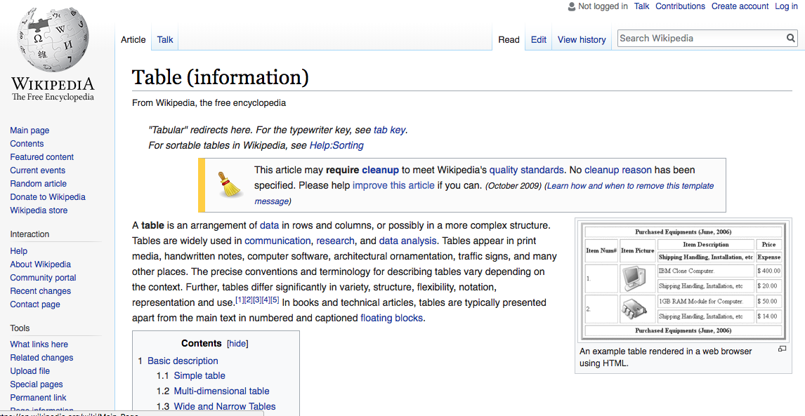

Webscraping
========================================================
author: PS239T
date: Spring 2018
autosize: TRUE

Learning Objectives
========================================================

- discern what components of a webpage are relevant to that task (CSS, HTML, Javascript) and which probably are not
- understand enough HTML structure to build a scraper 
- write a basic scraping tool
- understand some of the ethical concerns inherent in scraping

Why Webscrape?
========================================================

* Tons of web data useful for social scientists and humanists
	* social media
	* news media
	* government publications
	* organizational records

* Two kinds of ways to get data off the web
	* Webscraping - i.e. user-facing websites for humans (this week)
	* APIs - i.e. application-facing, for computers (two weeks ago)

Webscraping: Pros and Cons
========================================================

* Benefits:
	* Pretty much any content that can be viewed on a webpage can be scraped. (https://blog.hartleybrody.com/web-scraping/)
	* No API needed
	* No rate-limiting or authentication (usually)

* Challenges:
	* Rarely tailored for researchers
	* Messy, unstructured, inconsistent
	* Entirely site-dependent
	
	Webscraping vs. APIs
========================================================

* Rule of thumb:
  * Check for API first. If the API is not available, scrape.*
     - *If* the site allows you to do so, scrape. 
     - Wikipedia and IMDB both allow scraping, so those are easy sites to start with.
     
A Quick Example (Part 1)
========================================================
Let's say we want to scrape Wikipedia:




A Quick Example (Part 2)
========================================================

```
  First name   Last name Age
1       Tinu    Elejogun  14
2  Blaszczyk Kostrzewski  25
3       Lily   McGarrett  16
4  Olatunkbo    Chijiaku  22
5   Adrienne    Anthoula  22
6     Axelia  Athanasios  22
7  Jon-Kabat        Zinn  22
8    Thabang       Mosoa  15
9   Kgaogelo       Mosoa  11
```

Some Disclaimers
========================================================

* Check a site's terms and conditions before scraping.
* Check the source code for `robots.txt` - this may tell you that scraping is disallowed.
* Be nice - don't hammer the site's server.
* Sites change their layout all the time. Your scraper will break.

Reminders
========================================================

* SelectorGadget and Google Inspect are your friends.
* If you didn't have time to get comfortable with these tools last week, make sure to go back to the challenges and make sure you can answer them!


